# Joint Savings Account Smart Contract

This repository contains a Solidity smart contract designed for a fintech startup to automate the creation and management of joint savings accounts. The smart contract allows two authorized users to deposit and withdraw funds, leveraging the Ethereum blockchain for secure and transparent financial operations.

## Table of Contents

- [Introduction](#introduction)
- [Features](#features)
- [Solution Overview](#solution-overview)
- [Execution Results](#execution-results)
- [License](#license)

## Introduction

This Solidity smart contract facilitates the creation and management of joint savings accounts. Two user addresses can control the joint account, enabling deposits and withdrawals while maintaining a record of transactions and balances.

## Features

- **Deposit Funds**: Users can deposit ether into the joint savings account.
- **Withdraw Funds**: Authorized users can withdraw ether from the account.
- **Set Accounts**: Define the two user addresses authorized to control the account.
- **Balance Tracking**: Keep track of the contract balance and the last withdrawal details.

## Solution Overview

The `JointSavings` smart contract is implemented with the following core components:

- **Account Variables**: 
  - `accountOne` and `accountTwo` are `address payable` types representing the two authorized users.
  - `lastToWithdraw` is an `address public` type that stores the last account to make a withdrawal.
  - `lastWithdrawAmount` is a `uint public` type that stores the amount of the last withdrawal.
  - `contractBalance` is a `uint public` type that keeps track of the contract's current balance.

- **Functions**:
  - `setAccounts`: This function sets the addresses of the two authorized users.
  - `deposit`: A public payable function that allows ether to be deposited into the contract and updates the `contractBalance`.
  - `withdraw`: This function allows an authorized user to withdraw a specified amount of ether from the contract. It includes checks to ensure the recipient is authorized and that sufficient funds are available.
  - Fallback function: A function to handle ether sent to the contract outside of the `deposit` function.
  
### Execution Results

Below are the screenshots confirming the successful execution of deposit and withdrawal transactions, demonstrating the functionality of the JointSavings smart contract.

Setting Accounts

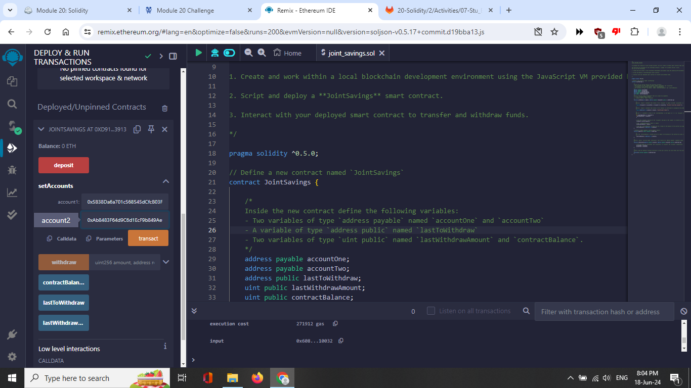

Terminal after setting

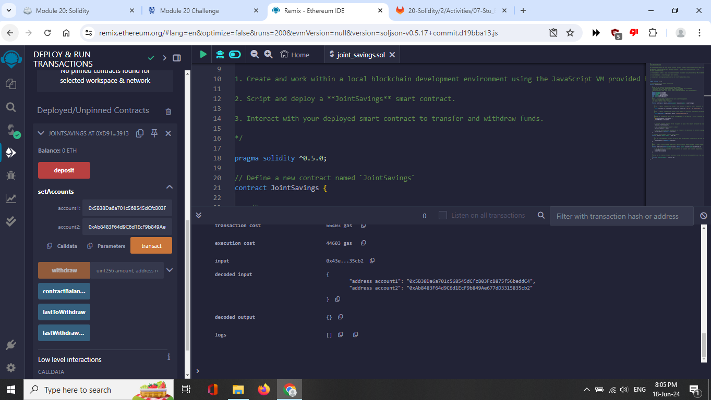

Deposit Transactions

Deposit 1 Ether
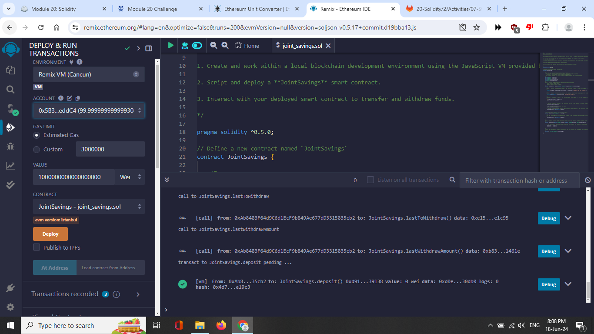

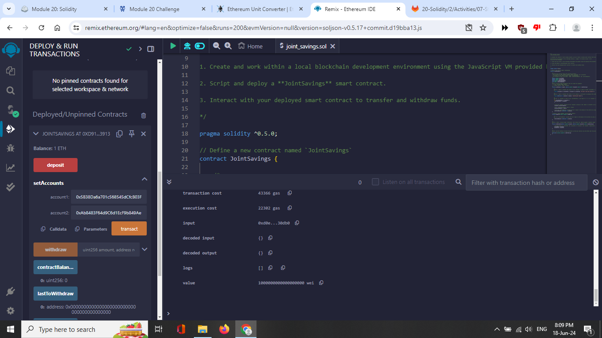

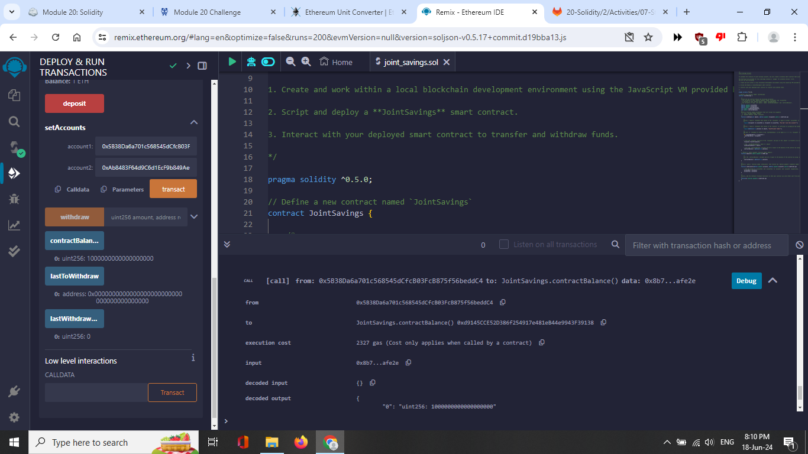

Deposit 10 Ether

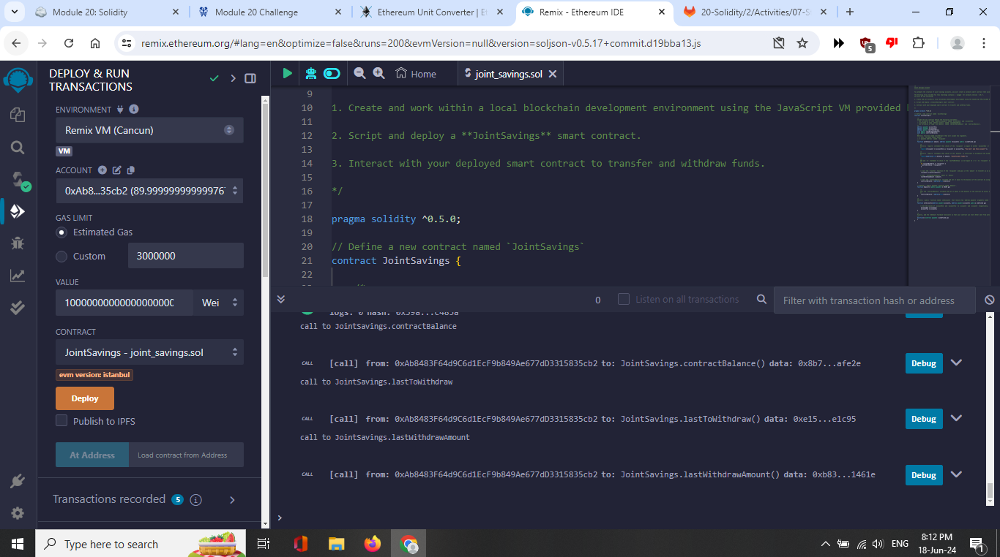

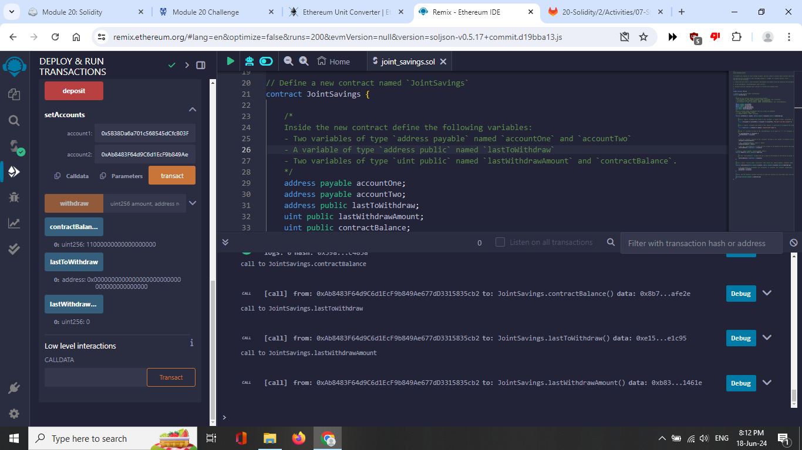

Deposit 5 Ether

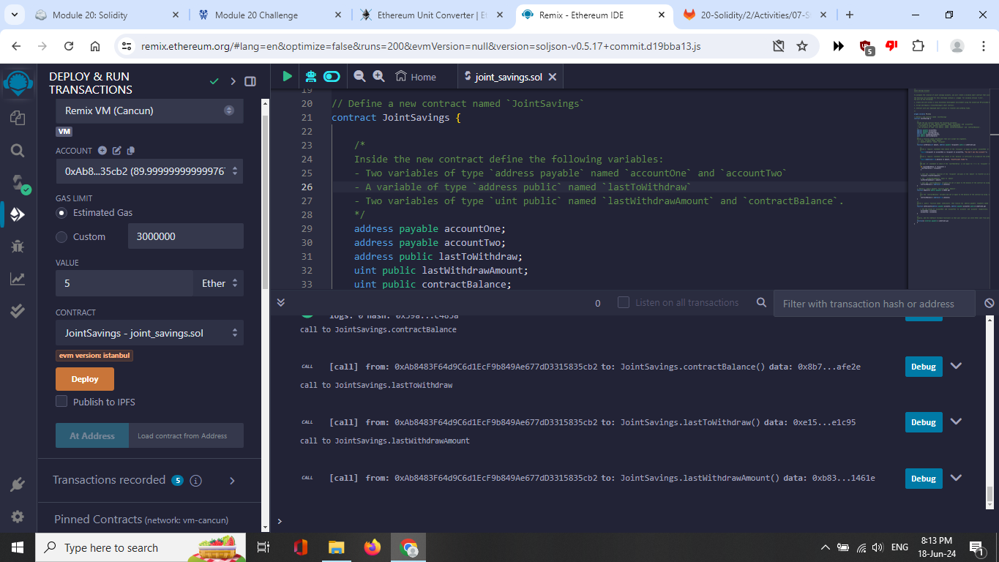

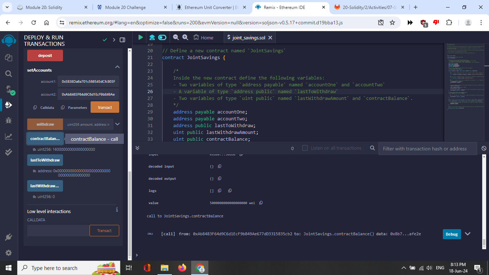

Withdrawal Transactions

Withdraw 5 Ether to Account One
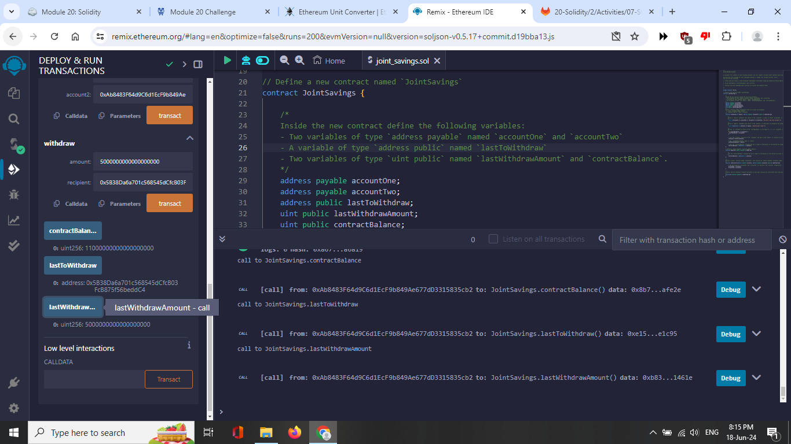

Balance and Withdrawal Verification

Last to Withdraw
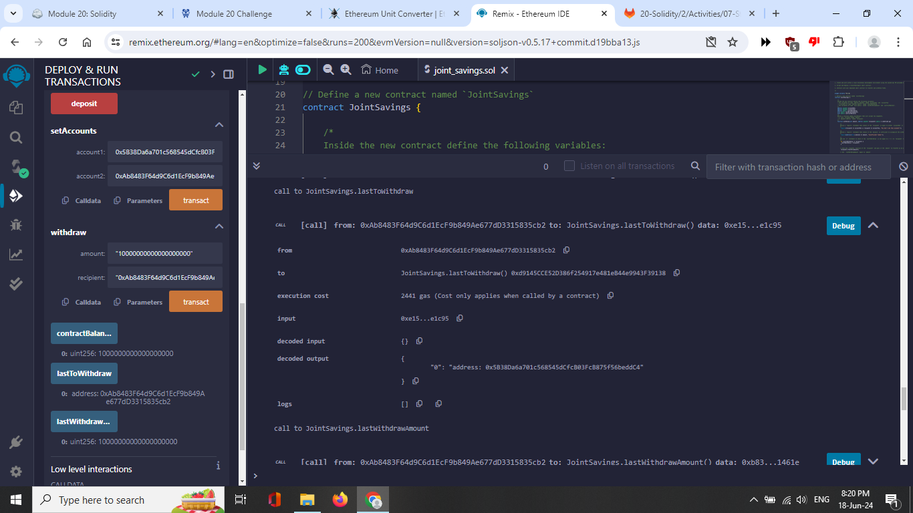

Last Withdraw Amount
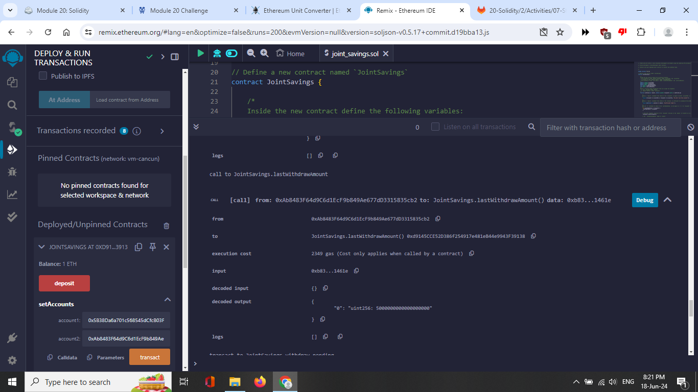

Withdraw 10 Ether to Account Two
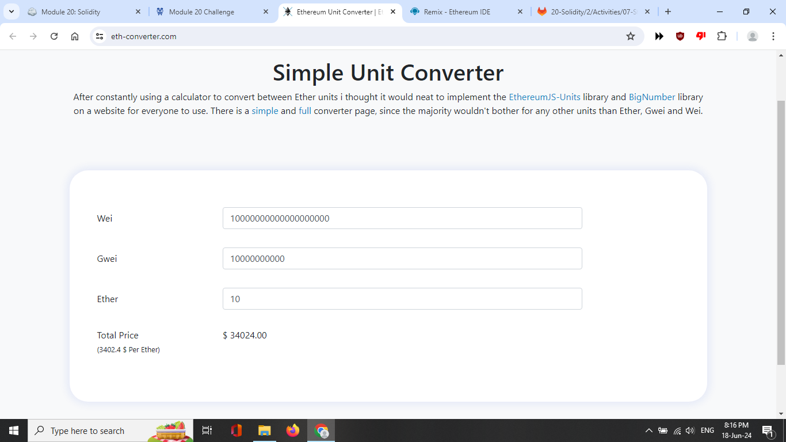

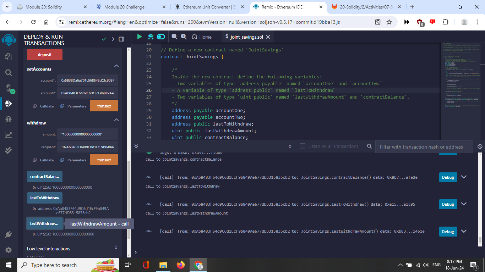

Balance and Withdrawal Verification

Last to Withdraw
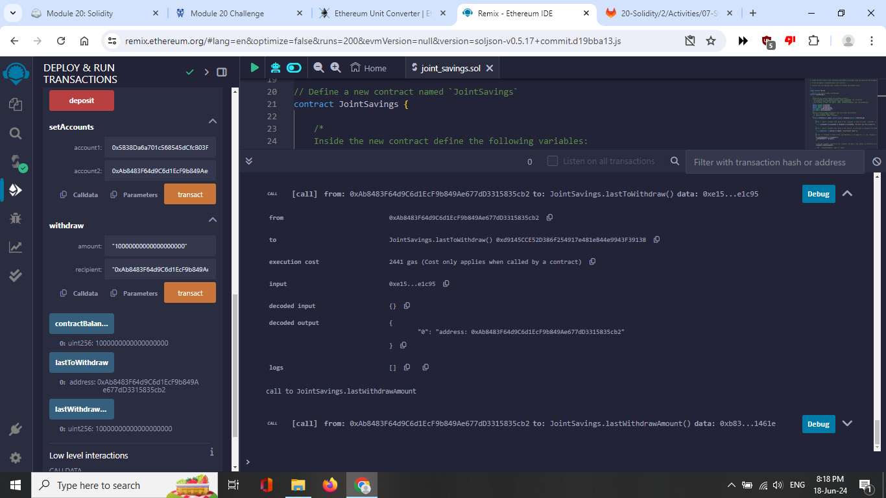

Last Withdraw Amount
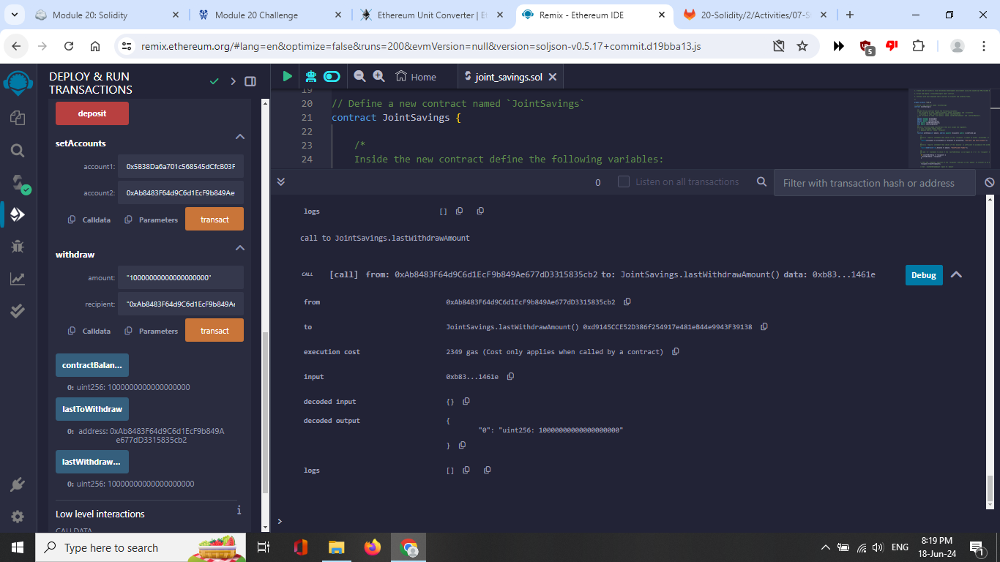